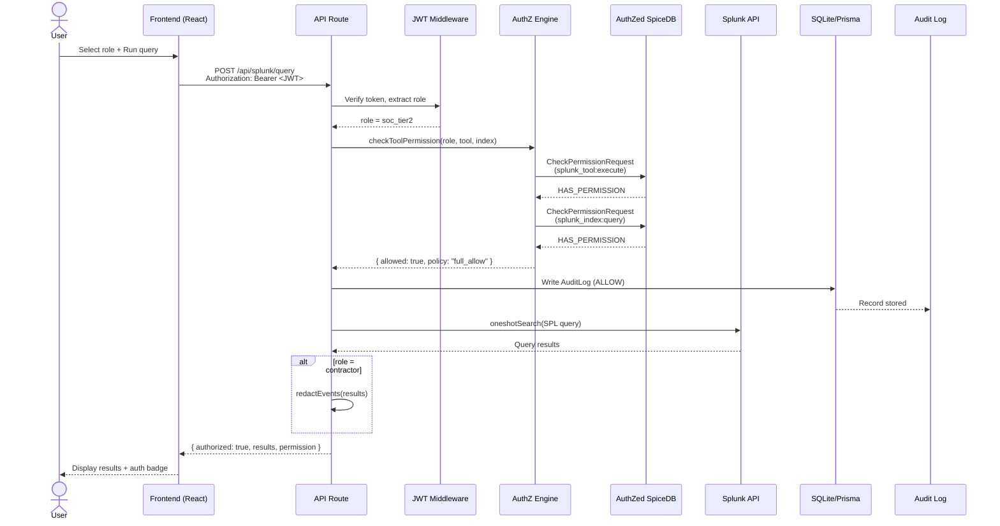
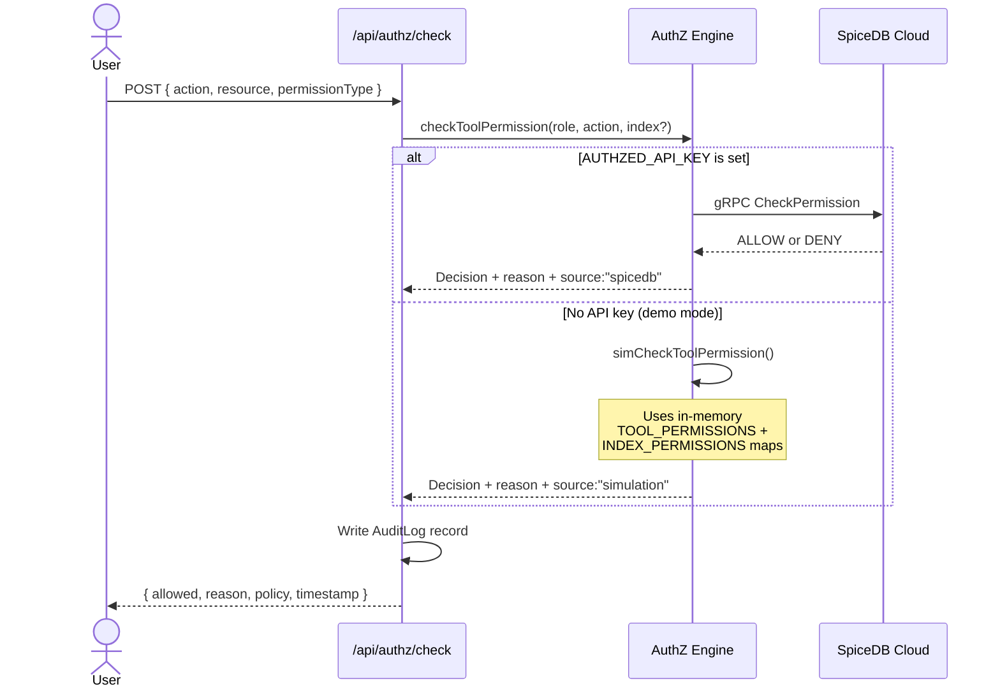
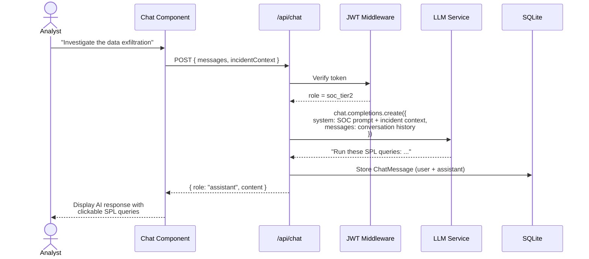
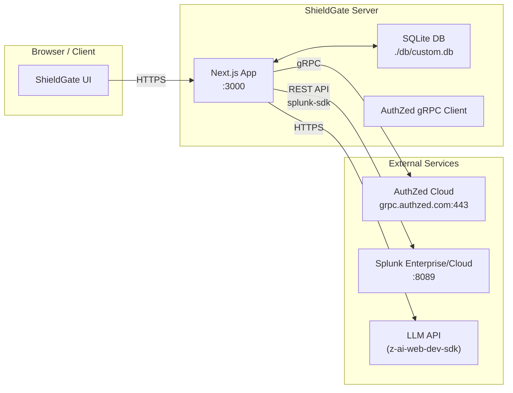

# ShieldGate Architecture Diagram

## System Overview

```mermaid
flowchart TB
    subgraph Users["User / Agent Layer"]
        SOC1["SOC Tier 1 Analyst"]
        SOC2["SOC Tier 2 Analyst"]
        SRE["SRE Engineer"]
        CON["Contractor"]
        AI["AI Agent<br/>(Claude / Custom LLM)"]
    end

    subgraph Frontend["ShieldGate Frontend<br/>(Next.js 16 + React 19)"]
        Dashboard["SOC Dashboard<br/>Role Switcher · Incident View<br/>AuthZ Timeline · SPL Console"]
        ChatUI["AI Investigation Chat<br/>Incident-Aware Prompts<br/>SPL Suggestions"]
        AuditUI["Authorization Audit Log<br/>ALLOW/DENY Timeline<br/>Compliance Reporting"]
    end

    subgraph API["ShieldGate API Layer<br/>(Next.js API Routes)"]
        ChatRoute["/api/chat"]
        QueryRoute["/api/splunk/query"]
        IndexRoute["/api/splunk/indexes"]
        AlertRoute["/api/splunk/alerts"]
        AuthZRoute["/api/authz/check"]
        IncidentRoute["/api/incidents"]
        AuditRoute["/api/audit"]
    end

    subgraph AuthLayer["Authorization Layer"]
        JWTMiddleware["JWT Auth Middleware<br/>Token Verification<br/>Role Extraction"]
        AuthZEngine["AuthZed Permission Engine"]
        SimFallback["Simulation Fallback<br/>(when AUTHZED_API_KEY not set)"]
    end

    subgraph AuthZedCloud["AuthZed SpiceDB Cloud<br/>(Google Zanzibar ReBAC)"]
        SpiceSchema["SpiceDB Schema<br/>user · team · splunk_index<br/>splunk_tool · incident"]
        SpiceRel["Relationship Tuples<br/>Team Memberships<br/>Index Permissions<br/>Tool Assignments"]
        SpiceCheck["CheckPermission API<br/>Per-Tool · Per-Index<br/>Pre-Execution Gates"]
    end

    subgraph SplunkLayer["Splunk Platform"]
        SplunkSDK["Splunk SDK<br/>(splunk-sdk npm)"]
        SplunkAPI["Splunk REST API<br/>port 8089"]
        SplunkIndexes["Splunk Indexes<br/>security · observability<br/>compliance · prod · hr"]
        SplunkAlerts["Splunk Saved Searches<br/>& Alert Actions"]
        SplunkMCP["Splunk MCP Server<br/>(11 Tools)"]
    end

    subgraph AILayer["AI / LLM Integration"]
        LLMSDK["z-ai-web-dev-sdk"]
        LLMService["LLM Chat Completions<br/>Incident Investigation<br/>SPL Query Generation"]
        SystemPrompt["System Prompt<br/>SOC Context · Splunk Awareness<br/>SPL Best Practices"]
        FallbackAI["Fallback Response Engine<br/>Pattern-Matched Suggestions<br/>(when SDK unavailable)"]
    end

    subgraph DataLayer["Data Layer"]
        SQLite["SQLite<br/>(via Prisma ORM)"]
        Incidents["Incident Model<br/>severity · status · title<br/>sourceIndex · assignedTeam"]
        AuditLogs["AuditLog Model<br/>userId · userRole · action<br/>decision · reason"]
        ChatMsgs["ChatMessage Model<br/>incidentId · role<br/>content"]
    end

    %% User to Frontend
    SOC1 --> Dashboard
    SOC2 --> Dashboard
    SRE --> Dashboard
    CON --> Dashboard
    AI --> ChatUI
    Dashboard --> ChatUI
    Dashboard --> AuditUI

    %% Frontend to API
    Dashboard --> QueryRoute
    Dashboard --> IndexRoute
    Dashboard --> AlertRoute
    Dashboard --> AuthZRoute
    Dashboard --> IncidentRoute
    Dashboard --> AuditRoute
    ChatUI --> ChatRoute

    %% API to Auth Middleware
    QueryRoute --> JWTMiddleware
    IndexRoute --> JWTMiddleware
    AlertRoute --> JWTMiddleware
    AuthZRoute --> JWTMiddleware
    IncidentRoute --> JWTMiddleware
    AuditRoute --> JWTMiddleware
    ChatRoute --> JWTMiddleware

    %% API to AuthZ Engine
    QueryRoute --> AuthZEngine
    IndexRoute --> AuthZEngine
    AlertRoute --> AuthZEngine
    AuthZRoute --> AuthZEngine

    %% AuthZ Engine to SpiceDB
    AuthZEngine -->|"gRPC<br/>CheckPermissionRequest"| SpiceCheck
    SpiceCheck --> SpiceSchema
    SpiceCheck --> SpiceRel
    AuthZEngine -->|"fallback when<br/>API key not set"| SimFallback

    %% API to Splunk
    QueryRoute --> SplunkSDK
    SplunkSDK --> SplunkAPI
    SplunkAPI --> SplunkIndexes
    SplunkAPI --> SplunkAlerts
    IndexRoute --> SplunkSDK
    AlertRoute --> SplunkSDK

    %% API to AI
    ChatRoute --> LLMSDK
    LLMSDK --> LLMService
    LLMService --> SystemPrompt
    ChatRoute -->|"fallback"| FallbackAI

    %% API to Data Layer
    IncidentRoute --> SQLite
    AuditRoute --> SQLite
    ChatRoute --> SQLite
    SQLite --> Incidents
    SQLite --> AuditLogs
    SQLite --> ChatMsgs
    AuthZRoute -->|"write ALLOW/DENY"| SQLite

    %% Splunk MCP Tools (referenced)
    SplunkMCP -.->|"wrapped by<br/>ShieldGate authz"| SplunkAPI

    %% Data Redaction
    QueryRoute -->|"role=contractor<br/>redactEvents()"| RedactPipeline["Data Redaction<br/>IPs · Users · Hashes<br/>Geo · Tokens"]
```



---

## How ShieldGate Interacts with Splunk

### Dual-Mode Connection

ShieldGate connects to Splunk through two pathways, with automatic failover:

1. **Production Mode (Splunk SDK):** When `SPLUNK_HOST` and `SPLUNK_TOKEN` environment variables are configured, ShieldGate uses the official `splunk-sdk` npm package to communicate with the Splunk REST API on port 8089. This supports real `oneshotSearch` queries, live index enumeration via the `indexes()` endpoint, and saved search/alert retrieval through the `savedSearches()` endpoint.

2. **Simulation Mode (Demo Fallback):** When Splunk credentials are not available, ShieldGate falls back to a built-in simulation layer (`splunk-sim.ts`) that provides realistic synthetic security events across three indexes (security, observability, compliance) with 24 realistic events, 8 alerts, and 5 indexes. This allows full demo functionality without requiring a live Splunk instance.

### Splunk MCP Server Tool Wrapping

ShieldGate acts as an **authorization proxy** in front of all 11 Splunk MCP Server tools:

| MCP Tool | ShieldGate API Route | AuthZ Check |
|---|---|---|
| `splunk_run_query` | `POST /api/splunk/query` | Tool + Index (read/query) |
| `splunk_get_indexes` | `GET /api/splunk/indexes` | Tool execute |
| `splunk_get_index_detail` | `GET /api/splunk/indexes?name=` | Tool execute |
| `splunk_get_alerts` | `GET /api/splunk/alerts` | Tool execute + Role filter |
| `splunk_ai_assistant` | `POST /api/chat` | Tool execute |
| `splunk_search_history` | Audit trail | Tool execute |
| `splunk_describe` | Index metadata | Tool execute |
| `splunk_get_kv_store` | Planned | Tool execute |
| `splunk_list_inputs` | Planned | Tool execute |
| `splunk_get_dashboard` | Planned | Tool execute |
| `splunk_get_lookup` | Planned | Tool execute |

Every tool call passes through the AuthZed permission check **before** reaching Splunk. Denied queries never hit the Splunk API, implementing true pre-execution authorization.

### Query Flow Example

```
User selects "SOC Tier 2" role and runs: index=security severity=critical | stats count by action

1. JWT Middleware extracts role from Bearer token → soc_tier2
2. POST /api/splunk/query receives { spl: "index=security severity=critical | stats count by action", index: "security" }
3. AuthZ Engine calls checkToolPermission("soc_tier2", "splunk_run_query", "security")
   → SpiceDB CheckPermission: splunk_tool/splunk_run_query#execute @ soc_tier2_user → ALLOW
   → SpiceDB CheckPermission: splunk_index/security#query @ soc_tier2_user → ALLOW
4. Query forwarded to Splunk SDK (or simulation fallback)
5. Results returned with permission metadata
6. AuditLog record written: { decision: "ALLOW", policy: "full_allow", source: "spicedb" }
```

---

## How AI Models and Agents Are Integrated

### LLM-Powered Incident Investigation

ShieldGate integrates an AI assistant through the `/api/chat` endpoint for context-aware security incident investigation:

1. **Backend Integration:** The chat route uses the `z-ai-web-dev-sdk` package to call LLM chat completions. The AI receives a system prompt tailored for SOC operations, including knowledge of SPL query syntax, incident investigation workflows, and Splunk best practices.

2. **Incident-Aware Context:** When an analyst is investigating a specific incident, the full incident context (severity, source index, description, raw events) is injected into the conversation as additional system context. This allows the AI to generate relevant SPL queries specific to the incident being investigated.

3. **SPL Query Generation:** The AI generates suggested SPL queries wrapped in code blocks, which users can click to execute directly through the authorized query pipeline. Each suggested query still passes through the AuthZed permission check, so AI-suggested queries are also subject to least-privilege enforcement.

4. **Fallback Intelligence:** When the AI SDK is unavailable, a pattern-matching fallback engine provides investigation guidance based on keyword detection (exfiltration, brute force, lateral movement, etc.) with pre-written SPL query suggestions.

5. **AI Agent Role:** The system includes a dedicated "AI Agent" role that simulates how an automated AI agent would interact with Splunk through ShieldGate. This role has broad read access across all indexes but requires human approval for remediation queries, demonstrating human-in-the-loop AI agent governance.

### Human-in-the-Loop Design

The AI agent role implements conditional permissions through constraint metadata:
- **Remediation queries** (UPDATE, DELETE, inputlookup writes) require human approval
- **Investigation queries** (search, stats, timechart) are auto-approved
- All AI actions are logged in the audit trail with the `ai_agent` role tag

---

## Data Flow Between Services, APIs, and Application Components

### Primary Request Flow



### Permission Check Flow



### AI Chat Flow



---

## Component Inventory

| Component | Technology | Purpose |
|---|---|---|
| **Frontend** | Next.js 16, React 19, TypeScript, Tailwind CSS 4, shadcn/ui | SOC dashboard with role switching, incident view, SPL console, AI chat, audit timeline |
| **API Routes** | Next.js Route Handlers | RESTful endpoints for Splunk operations, auth checks, incidents, chat, audit |
| **JWT Auth Middleware** | `jose` library | Token verification, role extraction, dev bypass with `AUTH_DISABLED=true` |
| **AuthZed Client** | `@authzed/authzed-node` | gRPC connection to SpiceDB Cloud for Zanzibar-style ReBAC permission checks |
| **AuthZ Engine** | Custom TypeScript (`authz.ts`) | Dual-mode permission engine: real SpiceDB checks with in-memory simulation fallback |
| **Splunk Client** | `splunk-sdk` npm package | Production connection to Splunk REST API for queries, indexes, and alerts |
| **Splunk Simulation** | Custom TypeScript (`splunk-sim.ts`) | Synthetic security data for demo: 24 events, 8 alerts, 5 indexes, SPL parser |
| **AI Chat** | `z-ai-web-dev-sdk` | LLM chat completions for incident investigation with SPL query generation |
| **Database** | SQLite via Prisma ORM | Persistent storage for incidents, audit logs, and chat messages |
| **State Management** | Zustand (client), TanStack Query (server) | Real-time role state, query caching, server state synchronization |
| **Bootstrap Script** | `scripts/bootstrap-authzed.ts` | One-command setup of SpiceDB schema + 50+ relationship tuples + verification tests |
| **SpiceDB Schema** | Zanzibar Zed language | 5 definitions: `user`, `team`, `splunk_index`, `splunk_tool`, `incident` with computed permissions |

---

## Deployment Diagram

